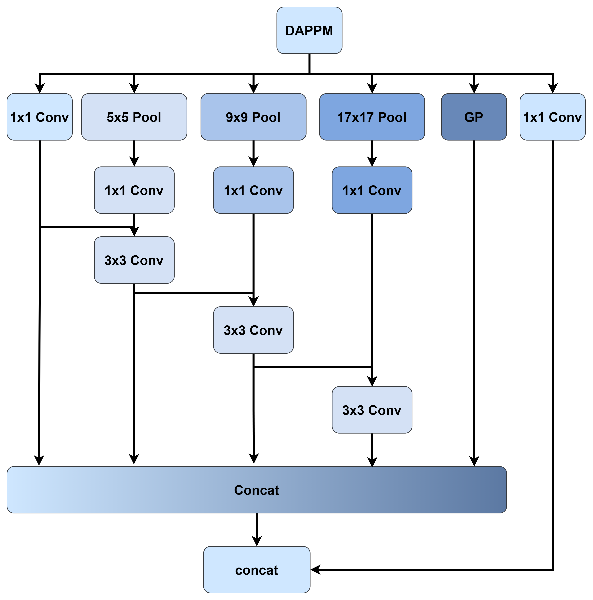
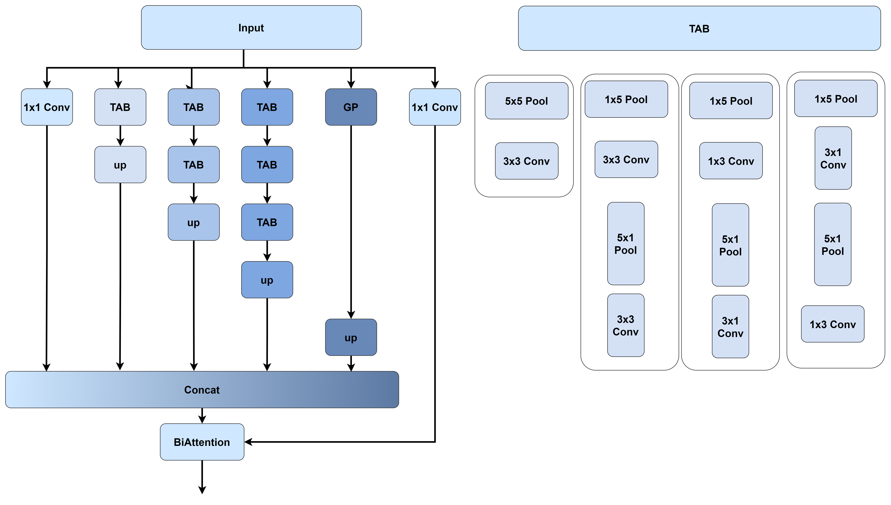
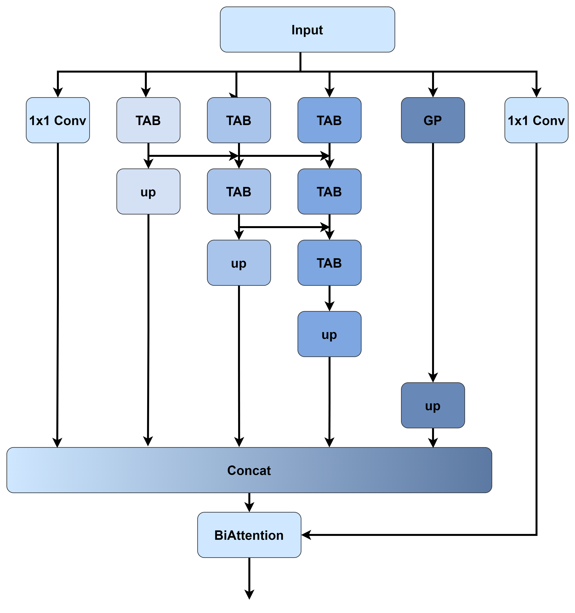
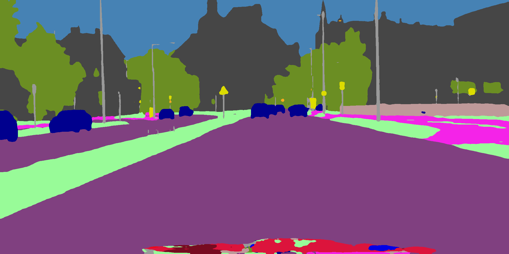
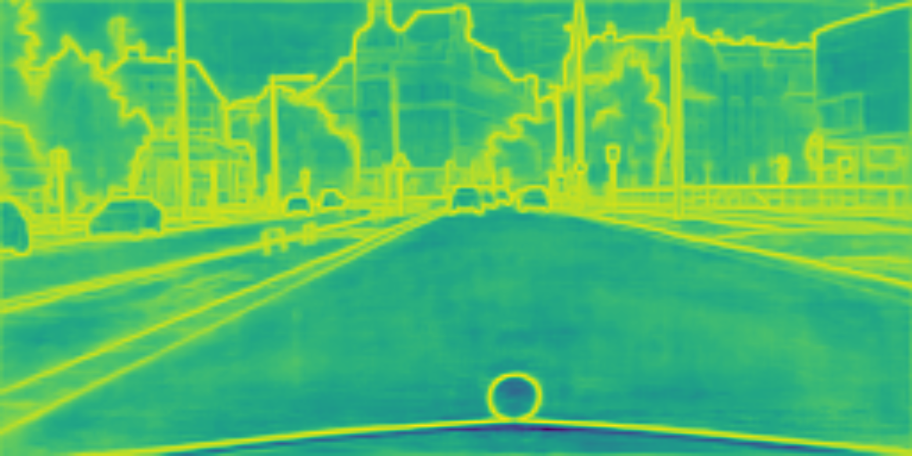
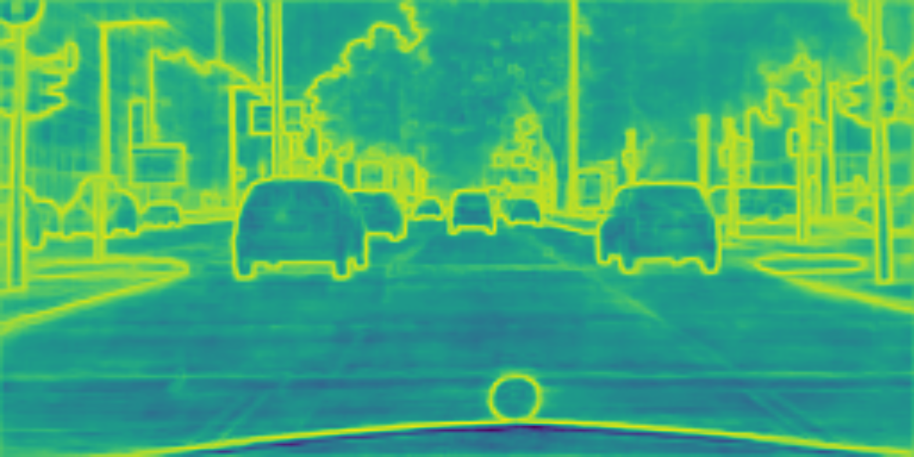
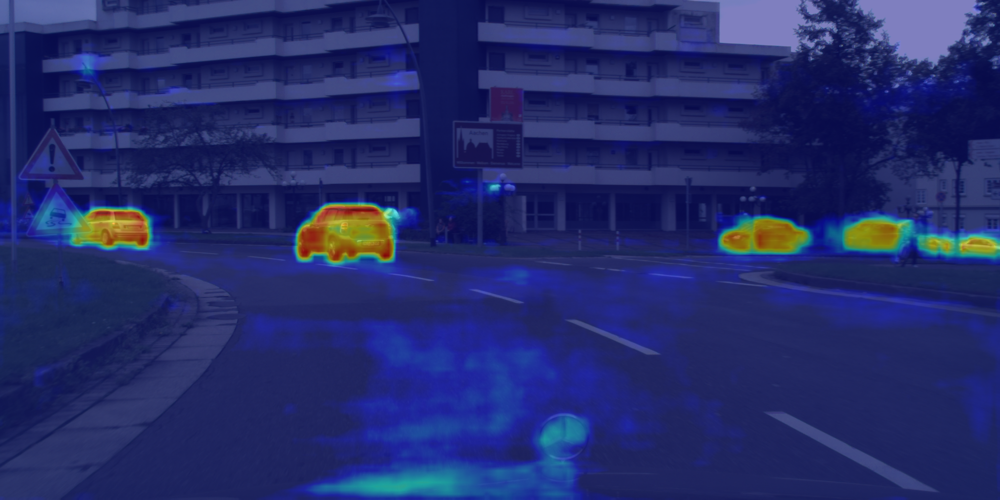
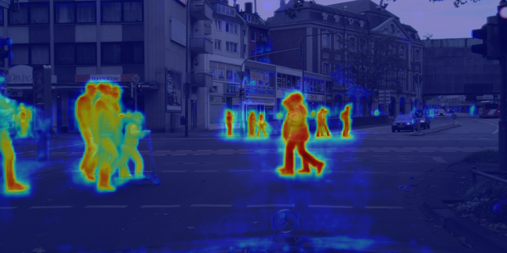

# Spatial-Assistant Encoder-Decoder Network forReal Time Semantic Segmentation

## The official implementation of "Spatial-Assistant Encoder-Decoder Network forReal Time Semantic Segmentation"

Link at arxiv：[SANet](https://arxiv.org/abs/2309.10519)

English | [中文](README_zh.md)

## SANet

<p align="center">
  </br>
  <span align="center">Comparing Inference Speed and Accuracy of Real-Time Models on the Cityscapes Dataset</span> 
</p>

### SANet network structure


### APPPM

APPPM did not come about overnight, the prototype of APPPM is DAPPM, our first idea was to try to reduce the branches of
DAPPM, which is really good for speed, and at the same time we observed the change of accuracy (we think there is almost
no degradation), but eventually we gave up this idea.

After that, we referred to the idea of SPPF, which is a kind of "use two 3x3 convolutions to replace one 5x5
convolution" idea applied to the pooling layer, and then tried to apply the idea of asymmetric convolution to the
pooling layer. In the results, the SPPF idea seems to be detrimental to the accuracy (of course, we did not do a
thorough study, so we cannot be completely sure), while the asymmetric pooling layer approach APPPM is a
feasible approach.

| DAPPM                    | DAPPM减少分支                  | SPPF TAB                 | SPPF TAB ADD                 |
|--------------------------|----------------------------|--------------------------|------------------------------|
|  |  |  |  |

<div align=center>
    
</div>

The feasibility of APPPM is easy to understand. Say you have an image with 30x30 resolution, if you reduce the image by
1/2 using normal pooling, the resolution is directly reduced to 15x15.
If you use convolution to extract features after the pooling layer, it is clear that you can only extract features once
at 15x15 resolution. With an asymmetric pooling layer, the resolution is first reduced to
30x15, then to 15x15.
If you still put the convolution behind the pooling layer to extract features, you can obviously extract more features
at a more detailed resolution.

Of course, from the list above, we also performed the operation of using asymmetric convolution to replace normal
convolution as mentioned in DMRNet, and the operation of feature multiplexing as mentioned in DDRNet. But in the end,
from the consideration of speed and accuracy, we finally proposed APPPM.(In the beginning, the model was referred to as
TAPPM and in SANet's modeling code as TAPPM)

### SAD

<div align=center>
    
</div>
Specific structure of Simple Attention Decoder[README_zh.md](README_zh.md)

## Use

### Prepare data

Download the datasets [Cityscapes](https://www.cityscapes-dataset.com/ "Cityscapes")
and [Camvid](http://mi.eng.cam.ac.uk/research/projects/VideoRec/CamVid/ "Camvid") from the website. if Camvid comes up
with Website not found!, try downloading the Camvid dataset
from [Motion-based Segmentation and Recognition Dataset](http://web4.cs.ucl.ac.uk/staff/g.brostow/MotionSegRecData/)
or  [Kaggle](https://www.kaggle.com/datasets/naureenmohammad/camvid-dataset?select=train)!

To further validate the model, we trained on
the [GTAV dataset](https://download.visinf.tu-darmstadt.de/data/from_games/) with nearly 25,000 sheets

### pre-training

In real-time semantic segmentation,Network in ImageNet pre-training common methods, if you wish to use ImageNet for
pre-training you can refer to our method. We have used this project [ImageNet](https://github.com/jiweibo/ImageNet) for
pre-training.

### train

Download the pre-trained weights we provided and put them into `pretrained_models/imagenet/`

Configure training parameters in the yaml file under the `config` folder, such
as `ExpName (experiment name)`, `ROOT (dataset directory)`,` END_EPOCH (training rounds)`, etc.

Start the training with our preset script train.sh or use the following command

```python tools/train.py --cfg configs/cityscapes/sanet_cityscapes_S.yaml```

### evaluate

Download the training weights we provided and put them in `pretrained_models/cityscapes/`or`pretrained_models/camvid/`

Configure evaluation parameters in the yaml file in the `config` folder, such as `ExpName`

```python tools/train.py --cfg=configs/cityscapes/sanet_cityscapes_S.yaml```

If you wish to submit the results of your test dataset to Cityscapes, change the `TEST_SET` parameter in the yaml file
in the `config` folder

## pre-training weight

#### ImageNet

| Model | SANet-S                                                                                                   | SANet-M                                                                                                   | SANet-L                                                                                                   |
|-------|-----------------------------------------------------------------------------------------------------------|-----------------------------------------------------------------------------------------------------------|-----------------------------------------------------------------------------------------------------------|
| Link  | [SANet-imagenet-S](https://drive.google.com/file/d/10Rdo_aXBwFuDhPRVmT7NXIHfN_34SHs-/view?usp=drive_link) | [SANet-imagenet-M](https://drive.google.com/file/d/17YlDa-1UnUDP8s_Ti1ZF8cJVBJgQp5fH/view?usp=drive_link) | [SANet-imagenet-L](https://drive.google.com/file/d/1R5y8exWqWWge-G77fD1H9en7s_BMVSPE/view?usp=drive_link) |

#### Cityscapes

| Model                                                                                            | Val(%mIou)  | Test(%mIou) | FPS  |
|--------------------------------------------------------------------------------------------------|-------------|-------------|------|
| [SANet-S](https://drive.google.com/file/d/15mTmKPu7DZ_BSkq2ZGyrCX6VQFG4qYn9/view?usp=drive_link) | 78.6 \ 79.9 | 77.2 \ 78.4 | 65.1 |
| [SANet-M](https://drive.google.com/file/d/1SpqLdzzinzJmcSQR08BATJxRfkBjdNx2/view?usp=drive_link) | 78.8 \ 80.2 | 77.6 \ 78.8 | 52.7 |
| [SANet-L](https://drive.google.com/file/d/1D3u4PexPrsAUAFgHIgCuFDpPgXfB5oC1/view?usp=drive_link) | 79.2 \ 80.6 | 78.1 \ 79.0 | 39.6 |

#### Camvid

| Model                                                                                            | Test(%mIou) | FPS |
|--------------------------------------------------------------------------------------------------|-------------|-----|
| [SANet-S](https://drive.google.com/file/d/1b3a6zggpTNDk0ktLZ5a7w8sw7vS1BPDC/view?usp=drive_link) | 78.8        | 147 |
| [SANet-M](https://drive.google.com/file/d/1YTcfIfl99xYQE98aUyiQkZqrg95g1qlm/view?usp=drive_link) | 79.5        | 126 |

#### GTAV
| Model                                                                                                          | Test(%mIou) |
|----------------------------------------------------------------------------------------------------------------|-------------|
| [PIDNet-S(no pretrain)](https://drive.google.com/file/d/1tTZIoGU4H4d4iqJZ-llD-y_nPT65RsAR/view?usp=drive_link) | 38.2        | 
| [SANet-S(no pretrain)](https://drive.google.com/file/d/1GVDvdvi0oPMCqDylpQTlwxtQ7iKPfcD8/view?usp=drive_link)  | 38.5        | 
| [PIDNet-S(Cityscapes)](https://drive.google.com/file/d/1ImflNkZMoN9Jl8zlGzvNRdnl21BbANWU/view?usp=drive_link)  | 45.0        | 
| [SANet-S(Cityscapes)](https://drive.google.com/file/d/1FQPemd5hvxJwsrl38cy0XW7iXqqPgj51/view?usp=drive_link)   | 48.0        | 

## Speed

The test speed follows the DDRNet and PIDNet test methodology, and the speed test is in ```models/sanet_speed.py```

## Tools

In computer vision, more image representations are beneficial. But the tools provided in different projects are
different, the used tools we use are provided here in the hope that they can help others.

### Segmentation Image

Segmentation maps are one of the most frequently used image representations for semantic segmentation.

|  |  |  |
|-------------------------------------------------------------------------------|-------------------------------------------------------------------------------|------------------------------------------------------------------------------|

The detailed code ```tools/generate_segmentation_image.py``` with other configurations

### Boundary Image

A boundary map is an image that shows the boundaries of a single object

|  |  |  |
|--------------------------------------------------------------------------------------|--------------------------------------------------------------------------------------|---------------------------------------------------------------------------------------|

The detailed code is in ```tools/generate_segmentation_image.py```, please set ``boundary`` to ``True``, and make other
configurations.

### Heat Map Image

In image segmentation tasks, heat maps can be used to represent the probability of which category or object each pixel
belongs to. Each category has a corresponding heat map that shows the distribution of pixels in that category.

|  |  |  |
|---------------------------------------------------------------------------------------------|----------------------------------------------------------------------------------------------|------------------------------------------------------------------------------------------------|

The detailed code is in ```tools/heat_map_drawing/heat_map_generator.py```, you need to import ``pytorch_grad_cam`` and
configure it before using it.

### Receptive Field

Receptive Field is the range of influence of a neuron or convolutional kernel in a deep learning model on the input
data.

#### Receptive Field Image

<div align=center>
    
    
    
    
    
</div>

The detailed code is in ```tools/receptive_field_generator/main.py``` with other configurations

#### Receptive Field Calculations

The Receptive Field calculation tool is at ``tools/receptive_field_tools/sanet_receptive_field_calculator.py``.

### Multi-category boundary losses

This is an approach mentioned in MSFNet. Unlike the common boundary loss which has only two classifications (yes or no
boundaries), the multi-category boundary loss splits into multiple categories (what categories are boundaries) according
to the category of the dataset.
We tried to incorporate this approach for SANet at that time, but did not find the corresponding code provided by
MSFNet. Therefore, we re-implemented this multi-category approach. However, the performance of the SANet to which we
added this approach did not perform well.
<div align=center>
    

</div>

The detailed code is in ```tools/multi_class_boundary_detection/multi_class_boundary_detection.py``` with other
configurations

## Citation

```
@misc{wang2023spatialassistant,
      title={Spatial-Assistant Encoder-Decoder Network for Real Time Semantic Segmentation}, 
      author={Yalun Wang and Shidong Chen and Huicong Bian and Weixiao Li and Qin Lu},
      year={2023},
      eprint={2309.10519},
      archivePrefix={arXiv},
      primaryClass={cs.CV}
}
```
