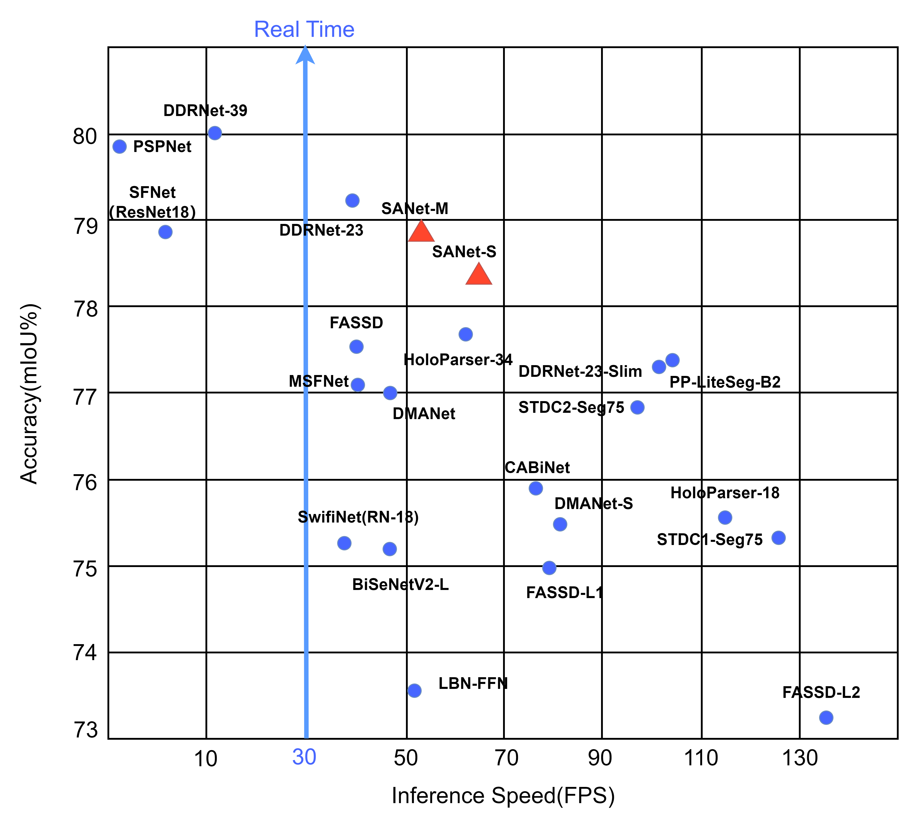

# 用于实时语义分割的空间辅助编码器-解码器网络
这里是SANet的官方代码仓库  
我们在arxiv的链接是：
## SANet网络

<p align="center">
  </br>
  <span align="center">在城市景观测试集上比较实时模型的推理速度和准确性</span> 
</p>

### 网络结构


SANet总体的结构图


### APPPM
APPPM的提出并不是一蹴而就的。APPPM的原型是DAPPM，我们的最初想法是尝试减少DAPPM的分支,这确实有利于加快速度，同时我们观察了精度的变化（我们认为几乎没有降低），但是最终还是放弃了这个想法。

之后，我们参考了SPPF的思路，这是一种将“使用两个3x3卷积替换一个5x5卷积”的思路应用到池化层的思路，并进而尝试了将非对称卷积的思路应用到池化层上。在结果上，SPPF的思路似乎不利于精度的提升（当然我们没有进行彻底的研究，所以不可以完全确定），而非对称池化层的方式APPPM却是一种
可行的方法。


DAPPM  | DAPPM减少分支                  | SPPF TAB                 | SPPF TAB ADD                 |
--------- |----------------------------|--------------------------|------------------------------|
  |  |  |  |


<div align=center>
    
</div>


APPPM的可行性很容易理解。假如你有一个30x30分辨率的图像，如果使用普通池化将图像降低1/2，则分辨率将直接被降低到15x15。
如果你在池化层之后在使用卷积来提取特征，很明显你只可以在15x15分辨率提取一次特征。而使用非对称池化层，则分辨率将先被降低到30x15，之后是15x15。
如果你依然将卷积放在池化层后面提取特征，很明显你可以在更细致的分辨率上提取更多的特征。

当然，从上边的列表我们也进行了DMRNet中提到的使用非对称卷积替换普通卷积的操作以及DDRNet提到的特征复用的操作。但最后从速度和精度考虑，我们最后提出了APPPM
### SAD

[//]: # (![Simple Attention Decoder]&#40;figs/SAD.png&#41;)
<div align=center>
    
</div>
Simple Attention Decoder的具体结构

## 使用
### 准备数据
从网站下载数据集([Cityscapes](https://www.cityscapes-dataset.com/ "Cityscapes")和[Camvid](http://mi.eng.cam.ac.uk/research/projects/VideoRec/CamVid/ "Camvid"))


如果Camvid出现Website not found!，请尝试从[Kaggle](https://www.kaggle.com/datasets/naureenmohammad/camvid-dataset?select=train)下载Camvid数据集
### 预训练
在实时语义分割,网络在ImageNet中预训练常见的方法，如果你希望使用ImageNet进行预训练可以参考我们的方法。
我们使用了这个项目[ImageNet](https://github.com/jiweibo/ImageNet)来进行预训练.
### 训练
1.下载我们提供的预训练权重并放入`pretrained_models/imagenet/`中


2.在`config`文件夹下的yaml文件中配置训练相关参数，如`ExpName(实验名称)`、`ROOT(数据集目录)`、`END_EPOCH(训练轮次)`等

3.使用我们预设的脚本train.sh启动训练或者使用以下命令


```python tools/train.py --cfg configs/cityscapes/sanet_cityscapes_S.yaml```


### 评估
1.下载我们提供的在Cityscapes或Camvid的训练权重并放到`pretrained_models/cityscapes/`或`pretrained_models/camvid/`


2.在`config`文件夹中的yaml文件中配置评估相关参数，如`ExpName`


3.如果希望将测试数据集的结果提交到Cityscapes上，请在`config`文件夹中的yaml文件中修改`TEST_SET`参数

## 预训练模型
#### ImageNet

Model  | SANet-S                                                                                                   | SANet-M                    | SANet-L                                                                                                   |
--------- |-----------------------------------------------------------------------------------------------------------|----------------------------|-----------------------------------------------------------------------------------------------------------|
Link  | [SANet-imagenet-S](https://drive.google.com/file/d/10Rdo_aXBwFuDhPRVmT7NXIHfN_34SHs-/view?usp=drive_link) | [SANet-imagenet-M](https://drive.google.com/file/d/17YlDa-1UnUDP8s_Ti1ZF8cJVBJgQp5fH/view?usp=drive_link) | [SANet-imagenet-L](https://drive.google.com/file/d/1R5y8exWqWWge-G77fD1H9en7s_BMVSPE/view?usp=drive_link) |

#### Cityscapes

Model  | Val(%mIou)  | Test(%mIou) | FPS  |
--------- |-------------|-------------|------|
[SANet-S](https://drive.google.com/file/d/15mTmKPu7DZ_BSkq2ZGyrCX6VQFG4qYn9/view?usp=drive_link)| 78.6 \ 79.9 | 77.2 \ 78.4 | 65.1 |
[SANet-M](https://drive.google.com/file/d/1SpqLdzzinzJmcSQR08BATJxRfkBjdNx2/view?usp=drive_link)| 78.8 \ 80.2 | 77.6 \ 78.8 | 52.7 |
[SANet-L](https://drive.google.com/file/d/1D3u4PexPrsAUAFgHIgCuFDpPgXfB5oC1/view?usp=drive_link)| 79.2 \ 80.6 | -    \  -   | -    |


## 在Cityscapes服务器提交的测试数据集结果

## 速度测试


## 工具
### 分割图
### 边界图
### 热力图
### 感受野
#### 感受野图
#### 感受野计算
### 视频

## 引用

## 鸣谢
