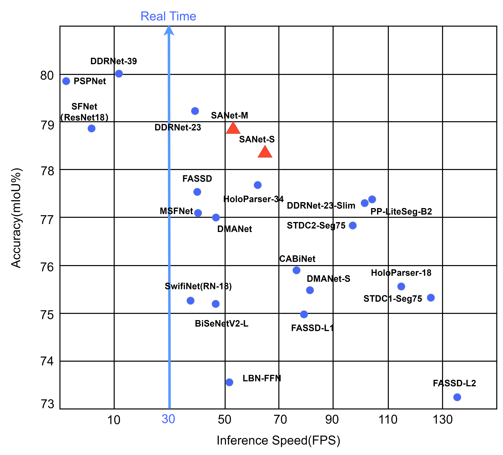
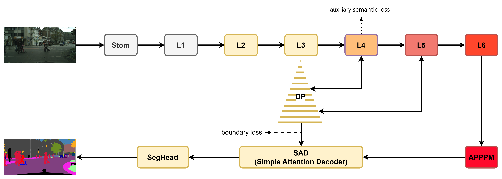
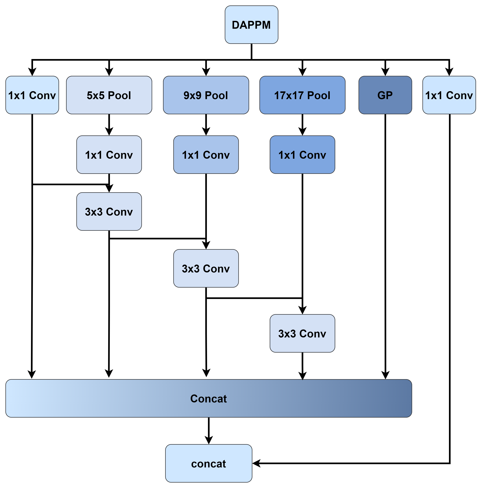
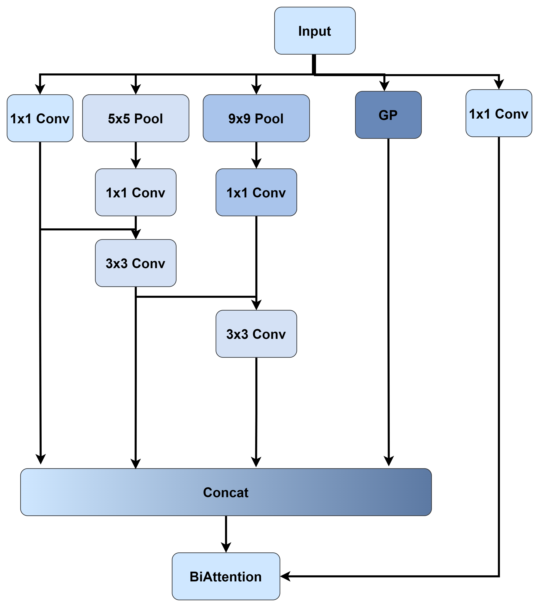
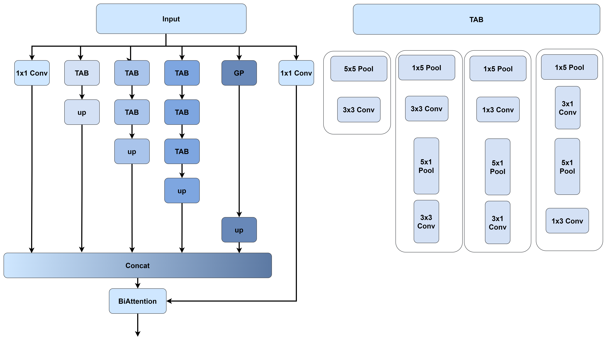
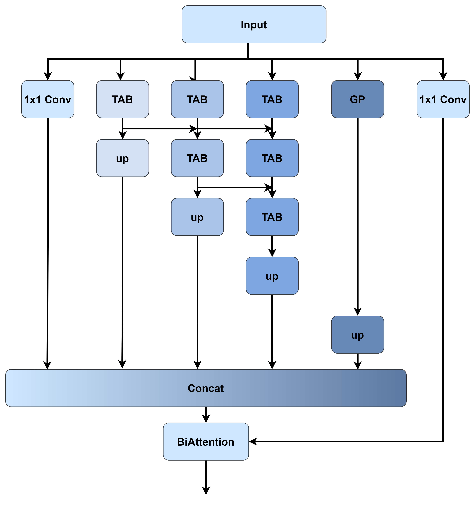
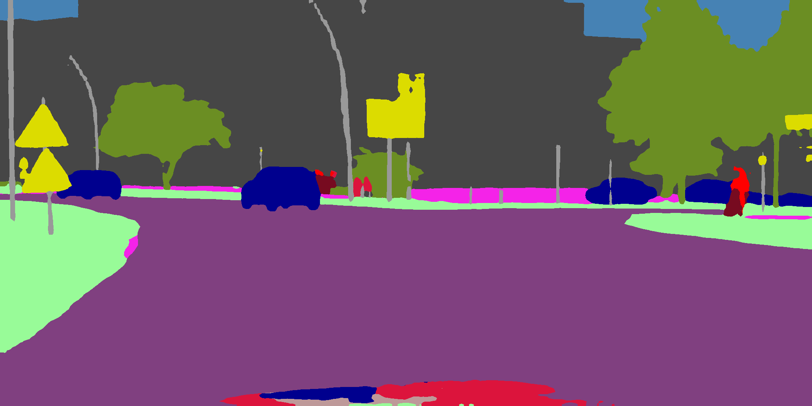
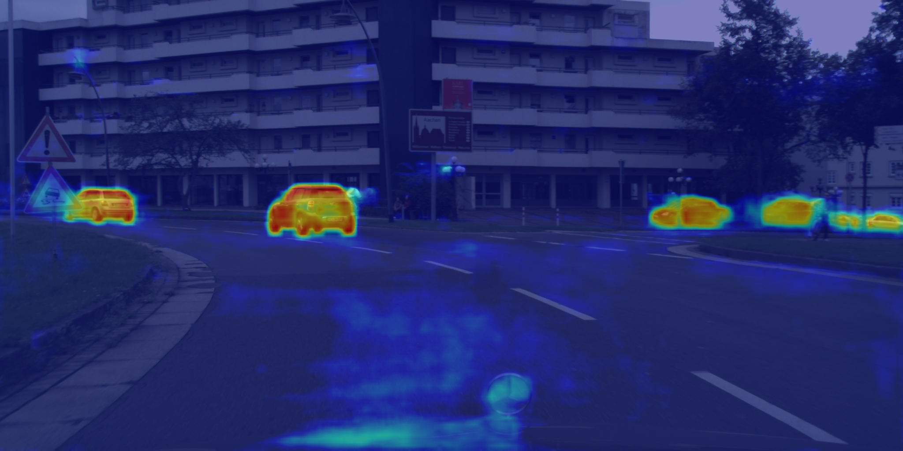
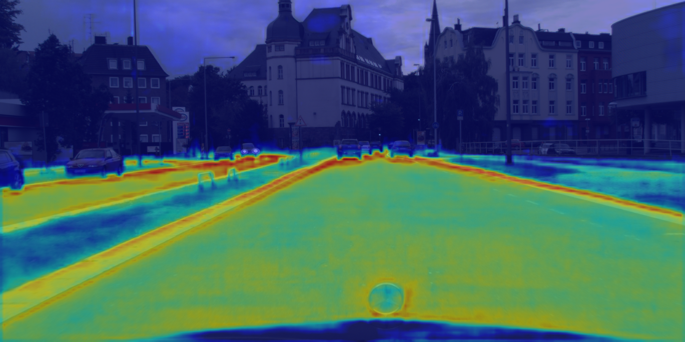
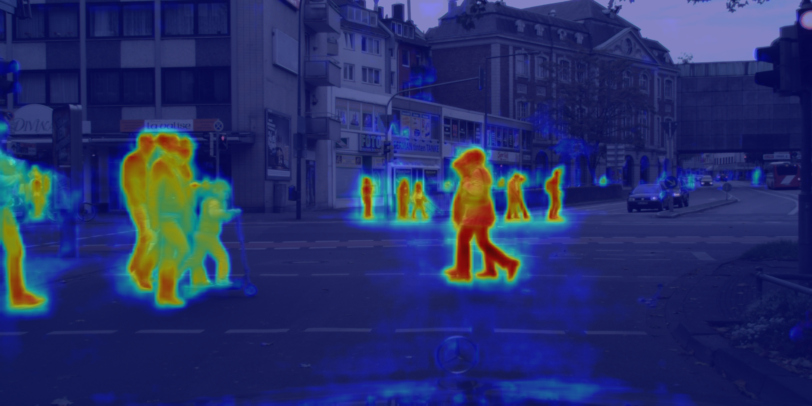

# 用于实时语义分割的空间辅助编码器-解码器网络

## 这里是SANet的官方代码仓库

我们在arxiv的链接是：[SANet](https://arxiv.org/abs/2309.10519)

[English](README.md) | 中文

## SANet网络

<p align="center">
  </br>
  <span align="center">在城市景观测试集上比较实时模型的推理速度和准确性</span> 
</p>

### 网络结构



SANet总体的结构图

### APPPM

APPPM的提出并不是一蹴而就的。APPPM的原型是DAPPM，我们的最初想法是尝试减少DAPPM的分支,这确实有利于加快速度，同时我们观察了精度的变化（我们认为几乎没有降低），但是最终还是放弃了这个想法。

之后，我们参考了SPPF的思路，这是一种将“使用两个3x3卷积替换一个5x5卷积”的思路应用到池化层的思路，并进而尝试了将非对称卷积的思路应用到池化层上。在结果上，SPPF的思路似乎不利于精度的提升（当然我们没有进行彻底的研究，所以不可以完全确定），而非对称池化层的方式APPPM却是一种
可行的方法。

| DAPPM                    | DAPPM减少分支                  | SPPF TAB                 | SPPF TAB ADD                 |
|--------------------------|----------------------------|--------------------------|------------------------------|
|  |  |  |  |

<div align=center>
    
</div>


APPPM的可行性很容易理解。假如你有一个30x30分辨率的图像，如果使用普通池化将图像降低1/2，则分辨率将直接被降低到15x15。
如果你在池化层之后在使用卷积来提取特征，很明显你只可以在15x15分辨率提取一次特征。而使用非对称池化层，则分辨率将先被降低到30x15，之后是15x15。
如果你依然将卷积放在池化层后面提取特征，很明显你可以在更细致的分辨率上提取更多的特征。

当然，从上边的列表我们也进行了DMRNet中提到的使用非对称卷积替换普通卷积的操作以及DDRNet提到的特征复用的操作。但最后从速度和精度考虑，我们最后提出了APPPM(
在刚开始，该模型被称为TAPPM，且在SANet的模型代码中也是TAPPM)

### SAD

[//]: # (![Simple Attention Decoder]&#40;figs/SAD.png&#41;)
<div align=center>
    
</div>
Simple Attention Decoder的具体结构

## 使用

### 准备数据

从网站下载数据集([Cityscapes](https://www.cityscapes-dataset.com/ "Cityscapes")
和[Camvid](http://mi.eng.cam.ac.uk/research/projects/VideoRec/CamVid/ "Camvid"))

如果Camvid出现Website not found!
，请尝试从[Motion-based Segmentation and Recognition Dataset](http://web4.cs.ucl.ac.uk/staff/g.brostow/MotionSegRecData/)
或 [Kaggle](https://www.kaggle.com/datasets/naureenmohammad/camvid-dataset?select=train)下载Camvid数据集

为了进一步验证模型，我们在具有近25000张的[GTAV数据集](https://download.visinf.tu-darmstadt.de/data/from_games/)上进行了训练
需要注意的是images的17705.png和15188.png是无效的图像，我们在list/gtav/*.lst文件中没有使用这两张图片

### 预训练

在实时语义分割,网络在ImageNet中预训练常见的方法，如果你希望使用ImageNet进行预训练可以参考我们的方法。
我们使用了这个项目[ImageNet](https://github.com/jiweibo/ImageNet)来进行预训练。

### 训练

- 下载我们提供的预训练权重并放入`pretrained_models/imagenet/`中


- 在`config`文件夹下的yaml文件中配置训练相关参数，如`ExpName(实验名称)`、`ROOT(数据集目录)`、`END_EPOCH(训练轮次)`等

- 使用我们预设的脚本train.sh启动训练或者使用以下命令

```python tools/train.py --cfg configs/cityscapes/sanet_cityscapes_S.yaml```

### 评估

- 下载我们提供的在Cityscapes或Camvid训练的模型权重并放到`pretrained_models/cityscapes/`或`pretrained_models/camvid/`


- 在`config`文件夹中的yaml文件中配置评估相关参数，如`ExpName`

```python tools/train.py --cfg=configs/cityscapes/sanet_cityscapes_S.yaml```

- 如果希望将测试数据集的结果提交到Cityscapes上，请在`config`文件夹中的yaml文件中修改`TEST_SET`参数

## 预训练权重

#### ImageNet

| Model | SANet-S                                                                                                   | SANet-M                                                                                                   | SANet-L                                                                                                   |
|-------|-----------------------------------------------------------------------------------------------------------|-----------------------------------------------------------------------------------------------------------|-----------------------------------------------------------------------------------------------------------|
| Link  | [SANet-imagenet-S](https://drive.google.com/file/d/10Rdo_aXBwFuDhPRVmT7NXIHfN_34SHs-/view?usp=drive_link) | [SANet-imagenet-M](https://drive.google.com/file/d/17YlDa-1UnUDP8s_Ti1ZF8cJVBJgQp5fH/view?usp=drive_link) | [SANet-imagenet-L](https://drive.google.com/file/d/1R5y8exWqWWge-G77fD1H9en7s_BMVSPE/view?usp=drive_link) |

#### Cityscapes

| Model                                                                                            | Val(%mIou)  | Test(%mIou) | FPS  |
|--------------------------------------------------------------------------------------------------|-------------|-------------|------|
| [SANet-S](https://drive.google.com/file/d/15mTmKPu7DZ_BSkq2ZGyrCX6VQFG4qYn9/view?usp=drive_link) | 78.6 \ 79.9 | 77.2 \ 78.4 | 65.1 |
| [SANet-M](https://drive.google.com/file/d/1SpqLdzzinzJmcSQR08BATJxRfkBjdNx2/view?usp=drive_link) | 78.8 \ 80.2 | 77.6 \ 78.8 | 52.7 |
| [SANet-L](https://drive.google.com/file/d/1D3u4PexPrsAUAFgHIgCuFDpPgXfB5oC1/view?usp=drive_link) | 79.2 \ 80.6 | 78.1 \ 79.0 | 39.6 |

#### Camvid

| Model                                                                                            | Test(%mIou) | FPS |
|--------------------------------------------------------------------------------------------------|-------------|-----|
| [SANet-S](https://drive.google.com/file/d/1b3a6zggpTNDk0ktLZ5a7w8sw7vS1BPDC/view?usp=drive_link) | 78.8        | 147 |
| [SANet-M](https://drive.google.com/file/d/1YTcfIfl99xYQE98aUyiQkZqrg95g1qlm/view?usp=drive_link) | 79.5        | 126 |

#### GTAV

| Model                                                                                                         | Test(%mIou) |
|---------------------------------------------------------------------------------------------------------------|-------------|
| [PIDNet-S(无预训练)](https://drive.google.com/file/d/1b3a6zggpTNDk0ktLZ5a7w8sw7vS1BPDC/view?usp=drive_link)       | 38.2        | 
| [SANet-S(无预训练)](https://drive.google.com/file/d/1b3a6zggpTNDk0ktLZ5a7w8sw7vS1BPDC/view?usp=drive_link)        | 38.5        | 
| [PIDNet-S(Cityscapes)](https://drive.google.com/file/d/1b3a6zggpTNDk0ktLZ5a7w8sw7vS1BPDC/view?usp=drive_link) | 45.0        | 
| [SANet-S(Cityscapes)](https://drive.google.com/file/d/1YTcfIfl99xYQE98aUyiQkZqrg95g1qlm/view?usp=drive_link)  | 48.0        | 

## 速度测试

测试速度跟随了DDRNet和PIDNet的测试方法，速度测试在```models/sanet_speed.py```

## 工具

在计算机视觉中，更多的图像表达方式是有益的。但是不同的项目中提供的工具是不同的，在这里提供了我们使用的所用工具，希望可以帮助到其他人。

### 分割图

分割图是语义分割最经常使用的一种图像表达方式。

|  |  |  |
|-----------------------------------------------------------------------------|-----------------------------------------------------------------------------|------------------------------------------------------------------------------|

详细的代码在```tools/generate_segmentation_image.py```，并进行其他配置

### 边界图

边界图是显示单个物体边界的一种图像

|  |  |  |
|-----------------------------------------------------------------------------------|-----------------------------------------------------------------------------------|------------------------------------------------------------------------------------|

详细的代码在```tools/generate_segmentation_image.py```，请将`boundary`设置为`True`,并进行其他配置

### 热力图

在图像分割任务中，热力图可以用来表示每个像素属于哪个类别或对象的概率。每个类别都有一个相应的热力图，显示了该类别的像素分布情况。

|  |  |  |
|------------------------------------------------------------------------------------------|-------------------------------------------------------------------------------------------|---------------------------------------------------------------------------------------------|

详细的代码在```tools/heat_map_drawing/heat_map_generator.py```，使用前需要先导入`pytorch_grad_cam`，并进行其他配置

### 感受野

感受野是深度学习模型中神经元或卷积核在输入数据上的影响范围.

#### 感受野图

<div align=center>
    
    
    
    
    
</div>

详细的代码在```tools/receptive_field_generator/main.py```，并进行其他配置

#### 感受野计算

感受野的计算工具在```tools/receptive_field_tools/sanet_receptive_field_calculator.py```

### 多类别边界损失

这是在MSFNet中提到的一种方式。不同于常见的边界损失只有两种分类(是或不是边界)
，多类别的边界损失按照数据集的类别分成了多种类别(是什么类别的边界)。
我们当时尝试为SANet加入这种方法，但是并没有找到MSFNet提供的相应代码。因此，我们重新实现了这种多类别的方法。但是，我们加入这种方法的SANet性能表现的并不理想。
<div align=center>
    

</div>

详细的代码在```tools/multi_class_boundary_detection/multi_class_boundary_detection.py```，并进行其他配置

## 引用

```
@misc{wang2023spatialassistant,
      title={Spatial-Assistant Encoder-Decoder Network for Real Time Semantic Segmentation}, 
      author={Yalun Wang and Shidong Chen and Huicong Bian and Weixiao Li and Qin Lu},
      year={2023},
      eprint={2309.10519},
      archivePrefix={arXiv},
      primaryClass={cs.CV}
}
```
